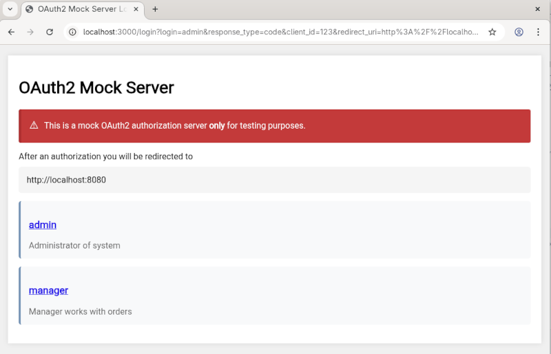
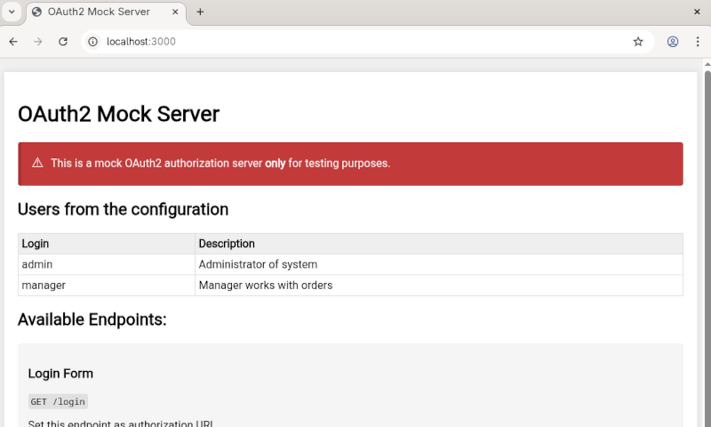

# OAuth2 Mock Server

A lightweight OAuth2 authorization server mock.
This server is designed **only** for testing OAuth2 flows in development and testing environments. Another case — use this as a simple OAuth2 provider for product demonstration.

## Features

- **Authorization Code Flow**: Complete implementation of the OAuth2 authorization code grant type
- **Token Endpoint**: Exchange authorization codes for access tokens
- **User Info Endpoint**: Retrieve user information specific to the authorized user
- **Configurable Users**: Load users from JSON configuration file with custom claims
- **Interactive User Selection**: Web interface to select users during authorization



## Quick Start

Run with Docker:
```
docker run -p 3000:3000 --name oauth2-mock leonidv/oauth2-mock:latest
```

And open welcome page in your browser: http://localhost:3000




## Configuration
Copy default (embedded) [configuration](config/application.json).
Run application with new config file:
```
oauth2-mock --config your-config.json
````

Each user is described by fields:
* **login** - internal login to authenticate. It is like login/password in the Google.
* **description** - some information about the user. Authorization page shows the description of each user.
* **userInfo** - any json object. The user_info endpoint returns this object "as-is".
  You can write any fields - usually same as your production OAuth2 provider.
