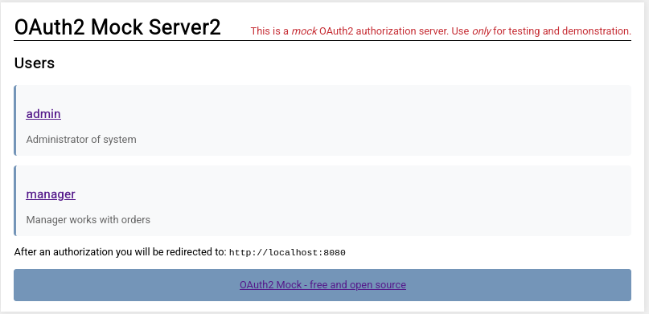

# OAuth2 Mock Server

A lightweight OAuth2 authorization-code-flow server for development, testing, and demo environments. **Do not use it to protect sensitive or production data.**



## Features

- Interactive user selection and configurable JSON user claims
- Authorization code flow, token, and UserInfo endpoints
- Configurable provider endpoint paths and authorization header prefix
- Optional access-code restriction and OAuth2 error scenarios

## Quick start

```sh
docker run -p 3000:3000 --name oauth2-mock leonidv/oauth2-mock:latest
```

Open <http://localhost:3000>.

## Configuration

The embedded defaults are in [config/application.json](config/application.json). Supply a JSON layer with `--config`:

```sh
oauth2-mock --config your-config.json
```

Sources are applied in this order: embedded defaults, `--config` file, `OAUTH2_MOCK_*` environment variables, then `--host` and `--port` CLI overrides. Objects merge recursively; arrays such as `users` replace the default array. Use `__` between nested environment keys:

```sh
OAUTH2_MOCK_SERVER__HOST=127.0.0.1 \
OAUTH2_MOCK_SERVER__PORT=8080 \
oauth2-mock
```

### Provider examples

Complete configurations: [Google](examples/google.json), [Facebook](examples/facebook.json), [Twitter](examples/twitter.json), and [Yandex ID](examples/yandex.json). Each defines the provider paths and matching `userInfo` response fields.

```sh
oauth2-mock --config examples/google.json
```

### Settings

| Section | Fields |
| --- | --- |
| `server` | `host`, `port` |
| `oauth2` | `name`, `authorization_path`, `token_path`, `userinfo_path`, `authorization_header_prefix` |
| `users` | `login`, `description`, `userInfo` |
| `access_restriction` | `enabled`, `code`, `sign_key` |

`userInfo` is returned as-is and can contain any JSON object. Endpoint paths must begin with `/`, be unique, and contain no query string or fragment. Configure paths—not complete URLs—because the mock server has one configured host and port.

## Access restriction

Set `access_restriction.enabled` to `true` and provide a non-empty `code` to require an access code during authorization. `sign_key` signs authentication cookies; it must be empty or at least 64 characters. An empty value generates a new key when the server starts.

Generate a key with:

```sh
oauth2-mock generate-sign-key
```
