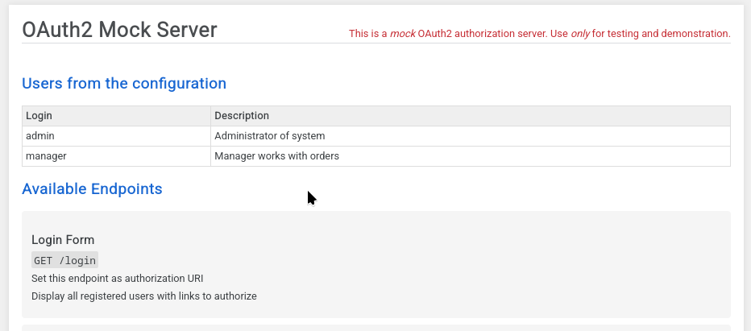
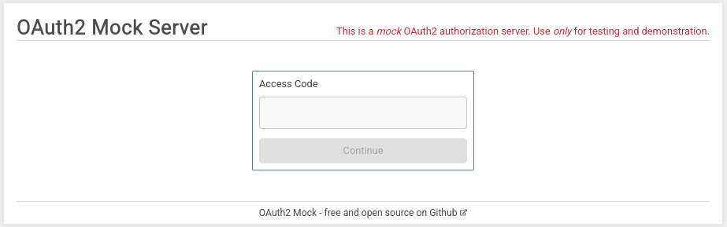

# OAuth2 Mock Server

A lightweight very simple OAuth2 authorization server mock.

This server is designed **only** for testing OAuth2 flows in development and testing environments. Another case — use this as a simple OAuth2 provider for product demonstration.

## Features

- **Configurable Users**: Load users from JSON configuration file with custom claims
- **Interactive User Selection**: Web interface to select users during authorization
- **Access Restriction**: Simple way restrict access to your demo environments.
- **Authorization Code Flow**: Complete implementation of the OAuth2 authorization code grant type
- **User Info Endpoint**: Retrieve user information specific to the authorized user
- **Negative scenarios**: Test how clients process error on getting access code and access token


## Quick Start

Run with Docker:
```
docker run -p 3000:3000 --name oauth2-mock leonidv/oauth2-mock:latest
```

And open welcome page in your browser: http://localhost:3000




## Configuration
The application starts with the embedded [default configuration](config/application.json).
You can add a partial JSON configuration layer:

```json
{
  "server": {
    "port": 8080
  }
}
```

```sh
oauth2-mock --config your-config.json
```

Configuration sources are applied in this order, from lowest to highest priority:

1. Embedded `config/application.json`
2. Optional JSON file selected by `--config`
3. Environment variables prefixed with `OAUTH2_MOCK_`
4. Explicit CLI overrides such as `--host` and `--port`

Use a double underscore to separate nested environment keys:

```sh
OAUTH2_MOCK_SERVER__HOST=127.0.0.1 \
OAUTH2_MOCK_SERVER__PORT=8080 \
OAUTH2_MOCK_ACCESS_RESTRICTION__ENABLED=true \
OAUTH2_MOCK_ACCESS_RESTRICTION__CODE=secret \
oauth2-mock
```

Objects are merged recursively. Arrays in JSON sources, including `users`, are replaced as a whole by a higher-priority JSON file. Complex `users` values are not supported through environment variables; use `--config` for them. Missing fields inherit the value from the previous layer; an explicit JSON `null` does not trigger fallback and is invalid for required fields.

Each user is described by fields:
* **login** - internal login to authenticate. It is like login/password in the Google.
* **description** - some information about the user. Authorization page shows the description of each user.
* **userInfo** - any json object. The user_info endpoint returns this object "as-is".
  You can write any fields - usually same as your production OAuth2 provider.

## Simple access restriction
If you use oauth2mock for a public demo stand of your application, you may want to restrict access to
the application. OAuth2mock implements a simple but effective access restriction mechanism 
using an Access Code to process OAuth2 flow. It ensures that only users who know the correct code can 
access your demo stand.

**Warning** Do not use oauth2mock to secure your demo application if it contains any private or 
sensitive information.



By default restriction access is disabled. You may enabled it using configuration's section `access_restriction`
* **enabled** Enables or disables the access restriction
* **code** The access code that users must enter to make OAuth2 authorization request. Can't be empty if access restriction is enabled 
* **sign_key** A secret key server uses to sign authentication cookies. Must be a string with a length of more than 64 characters. An empty string is allowed, but not recommended. If empty, oauth2mock will generate sing_key on each service restart. 

## Generate sign-key
oauth2mock can generate good sign_key for you:
```
oauth2-mock generate-sign-key
```
Copy output string and paste into the configuration.